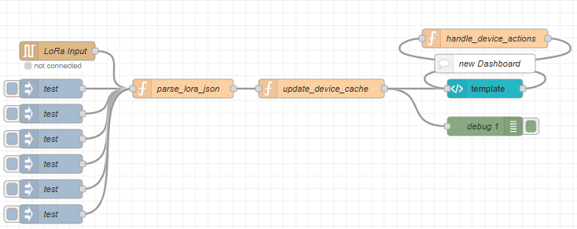

# Node-RED flow — LoRa-ontvanger

## Inleiding

Deze Node-RED-flow leest LoRa-data in op de Raspberry Pi, verwerkt de ontvangen JSON-pakketten en stuurt zowel het dashboard als de LCD-weergave aan.

De flow vormt de centrale schakel tussen de LoRa-ontvanger en de eindgebruiker en zorgt voor een betrouwbare verwerking en visualisatie van alle binnenkomende data. Naast het dashboard wordt ook de volledige logica voor het aansturen van het LCD-scherm binnen deze Node-RED-flow afgehandeld.

De belangrijkste onderdelen van de flow zijn:

* `LoRa Input` – ontvangt ruwe data via UART
* `parse_lora_json` – valideert en verrijkt de JSON-data
* `update_device_cache` – houdt actieve devices en hun laatste data bij
* `template (UI)` – visualiseert data in het dashboard
* `handle_device_actions` – verwerkt acties vanuit de gebruikersinterface

De function nodes worden in de volgende secties afzonderlijk en gedetailleerd uitgewerkt.

---

## Overzicht van de flow

Onderstaande afbeelding toont de volledige Node-RED-flow van de ontvanger. De LoRa-data komt via UART de flow binnen, daarna worden de JSON-pakketten geparset en in een device-cache opgeslagen. Vervolgens worden het dashboard, het LCD-scherm en de acties vanuit de UI afgehandeld.

> **Let op:** onderstaande afbeelding toont nog de **oude** Node‑RED‑flow.  

---

## LoRa Input

Deze node vormt het startpunt van de flow en ontvangt ruwe data via de UART-verbinding met de E220 LoRa-module.

**Inkomend:**

* Seriële data (UART)

**Uitgaand:**

* JSON-string naar `parse_lora_json`

---

## parse_lora_json

*(Wordt later uitgewerkt.)*

---

## update_device_cache

*(Wordt later uitgewerkt.)*

---

## handle_device_actions

*(Wordt later uitgewerkt.)*

---

## template (UI)

*(Wordt later uitgewerkt.)*

---

*Gemaakt door Anish*
